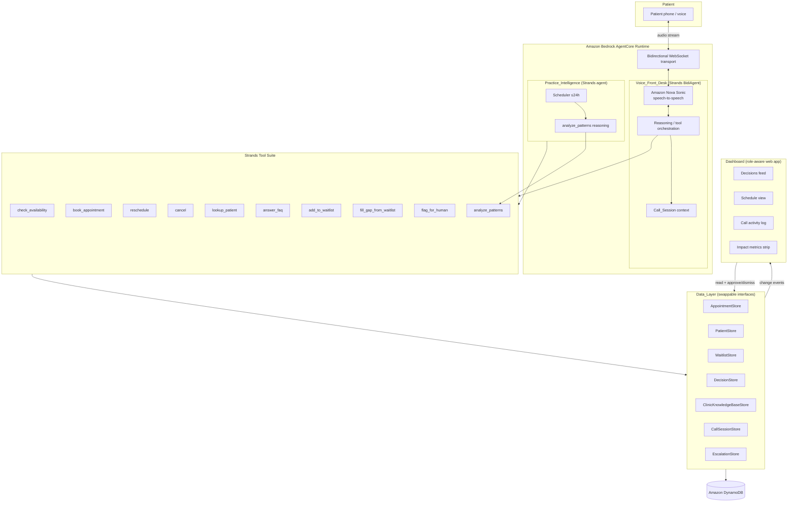
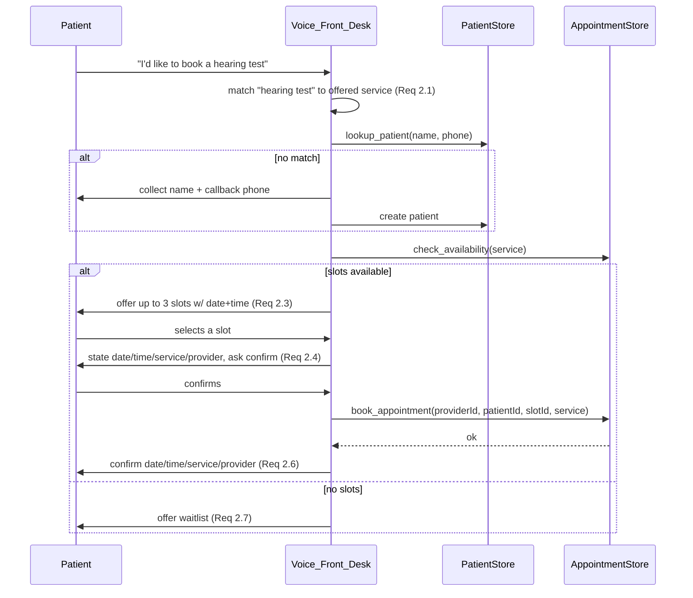
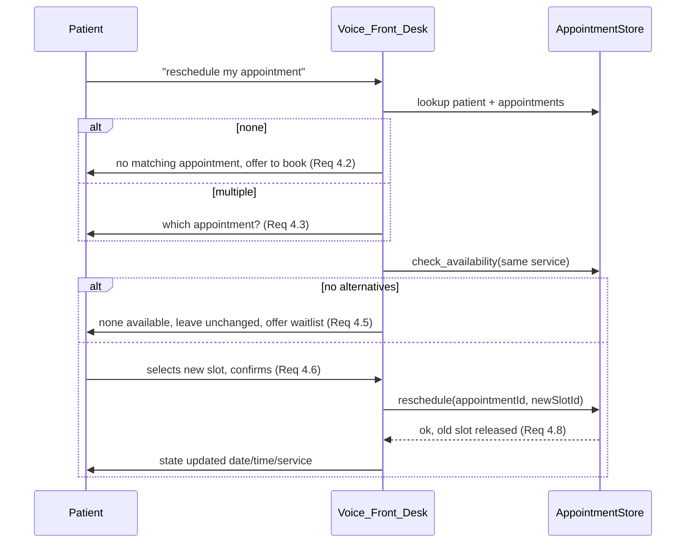
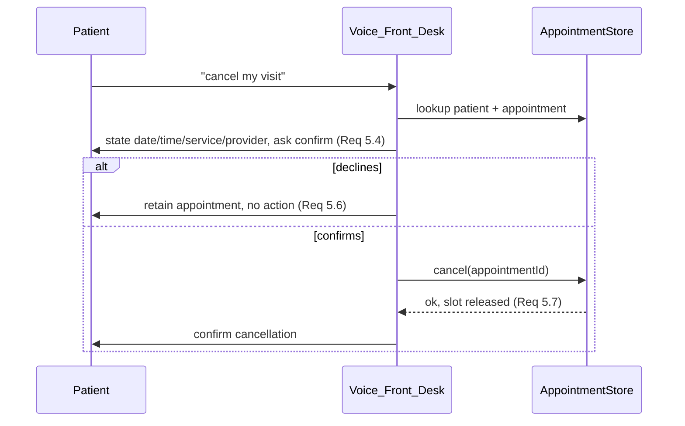
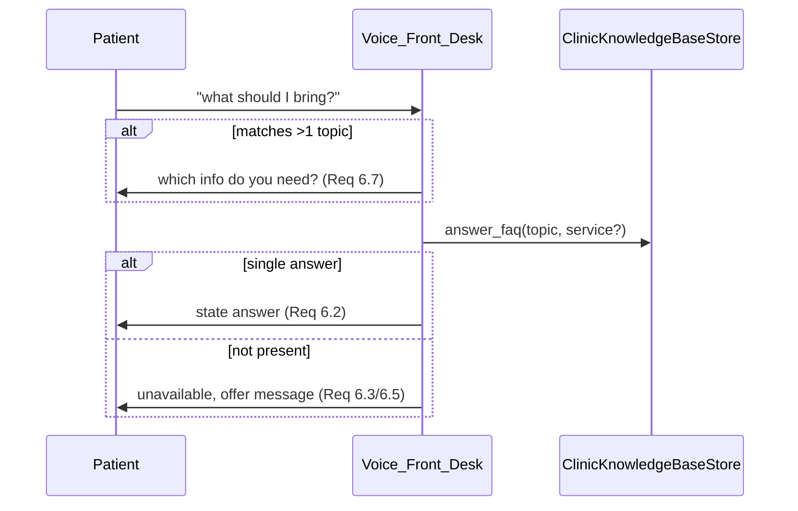
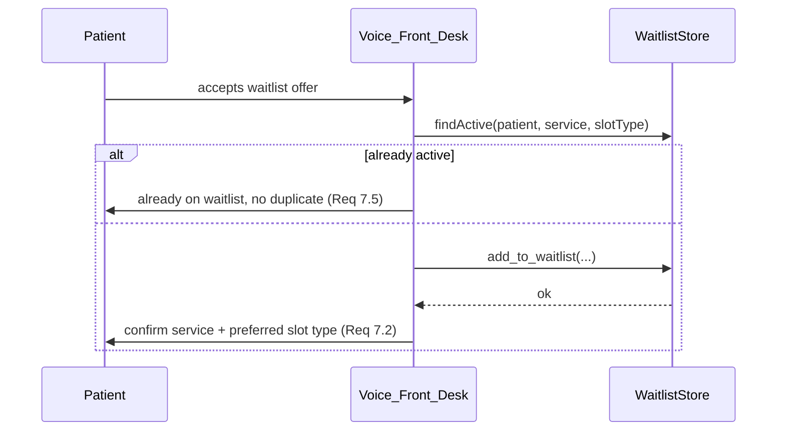
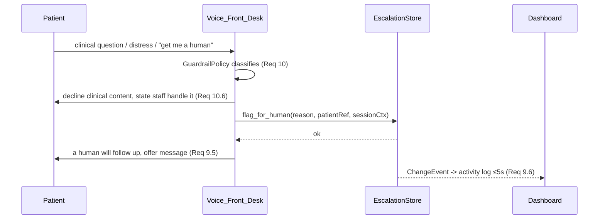
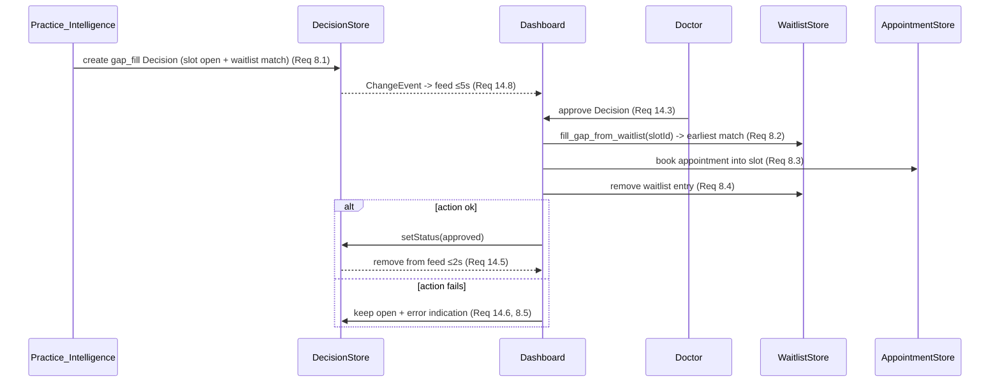
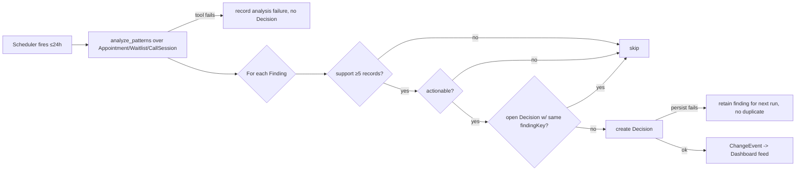

# Design Document

## Overview

The Clinic Front-Desk Voice Agent is a two-agent system for a solo-doctor ENT clinic, deployed on Amazon Bedrock AgentCore Runtime and backed by Amazon DynamoDB.

- **Voice_Front_Desk** — a reactive, patient-facing agent. It is built as a Strands Agents SDK `BidiAgent` voiced by Amazon Nova Sonic (speech-to-speech, real-time bidirectional streaming through Amazon Bedrock). It orchestrates ten Strands tools through multi-step reasoning to book, reschedule, cancel, answer FAQs, waitlist, look up patients, and escalate to a human. It is strictly administrative.
- **Practice_Intelligence** — an autonomous, doctor-facing background Strands agent. It runs on a recurring schedule (≤ 24 h), analyzes accumulated appointment, waitlist, and call-session data, and generates actionable Decisions for the doctor.
- **Dashboard** — a single role-aware web application (doctor view primary) presenting a Decisions feed (approve/dismiss), a schedule view, a call activity log, and an impact-metrics strip, with real-time propagation within the bounds required (2–5 s).
- **Data_Layer** — a set of swappable data-access interfaces (`AppointmentStore`, `PatientStore`, `WaitlistStore`, `DecisionStore`, `ClinicKnowledgeBaseStore`, `CallSessionStore`, plus an `EscalationStore`) backed by DynamoDB. Agents never touch storage directly; every entity that owns a schedule is provider-aware.

The system starts empty. The doctor onboards clinic configuration first; live calls populate data over time.

This design maps directly to the 16 requirements. Where a requirement drives a specific structural decision it is cited inline as `(Req N.M)`.

### Key Design Decisions

| Decision | Rationale |
| --- | --- |
| Use Strands `BidiAgent` + Nova Sonic rather than a hand-rolled STT→LLM→TTS pipeline | Nova Sonic is speech-to-speech; a single bidirectional stream removes transcription hops, which is what makes the ≤ 1.5 s response-start and ≤ 500 ms barge-in targets achievable (Req 12.1, 12.2). The SDK's `BidiAgent` manages stream lifecycle, tool routing, and session state. |
| Two separate agents (reactive vs. autonomous) sharing one Data_Layer | The patient call path is latency-critical and stateless-per-session; analysis is batch, latency-tolerant, and cross-session. Splitting them isolates failure domains and lets each scale independently (Req 13). |
| Data access behind narrow per-entity interfaces | Requirement 16 mandates swappable storage and provider-id enforcement in one place. Interfaces let us unit/property test agent logic against in-memory fakes. |
| Decisions are *proposals*, executed only on doctor approval | Keeps the human in the loop for all clinical/policy matters (Req 8.2, 10.5, 14.3). Practice_Intelligence never mutates schedule state on its own. |
| Guardrails enforced at the system-prompt layer *and* the tool layer | Defense in depth for the administrative-only rule (Req 10). The model is instructed to refuse clinical content; tools additionally refuse to select a service from a symptom. |

## Architecture



### Runtime Topology

- **AgentCore Runtime** hosts both agents. The Voice_Front_Desk is exposed through AgentCore's bidirectional WebSocket transport so audio flows patient ↔ Nova Sonic with minimal hops. Practice_Intelligence runs as a scheduled invocation within the same runtime (or a companion scheduled entrypoint) and shares the Data_Layer library.
- **Nova Sonic** handles ASR, dialogue prosody, TTS, and barge-in detection as a single speech-to-speech model. The Strands `BidiAgent` receives interpreted user turns, runs tool-calling reasoning, and streams responses back as audio.
- **Data_Layer** is a plain library (not a network service) linked into both agents and the Dashboard's backend. Storage is DynamoDB; swapping storage means swapping the interface implementation only (Req 16.5).
- **Dashboard** is a web app with a thin backend that reads through the Data_Layer and subscribes to change events for real-time updates.

## Components and Interfaces

### 1. Voice_Front_Desk (Strands BidiAgent + Nova Sonic)

Responsibilities:
- Own the Nova Sonic bidirectional stream for a Call_Session (Req 12).
- Maintain per-session conversational context: identifying details, requested service, requested date/time, slot selection (Req 11.1, 11.4).
- Run multi-step tool chains where each tool's output feeds the next (Req 11.2).
- Enforce administrative-only guardrails in its system prompt (Req 10).
- Handle barge-in, interpretation-failure retries, silence re-prompts, and voice-layer loss (Req 12.2–12.7).
- Persist Call_Session outcome on end (Req 11.5).

Sub-components:

| Sub-component | Role |
| --- | --- |
| `VoiceStreamManager` | Wraps the Strands `BidiAgent` / Nova Sonic stream; emits interpreted turns, handles barge-in stop (≤ 500 ms) and response-start timing (≤ 1.5 s). |
| `SessionContext` | In-memory store of the active Call_Session's collected facts and current task step. Enables resume-after-barge-in (Req 12.3) and partial-failure retention (Req 11.3). |
| `GuardrailPolicy` | Classifies each turn as administrative vs. clinical/out-of-rules; drives refuse-and-escalate behavior (Req 10). |
| `ToolOrchestrator` | Chains tool calls; on mid-chain failure retains context and offers to take a message (Req 11.3). |
| `TurnController` | Interpretation-failure counter (max 2), 10 s silence re-prompt (once), and voice-layer-loss handling (Req 12.4–12.7). |

### 2. Practice_Intelligence (autonomous Strands agent)

Responsibilities:
- Trigger on a recurring interval ≤ 24 h (Req 13.1).
- Invoke `analyze_patterns` over Appointment, Waitlist, and Call_Session data (Req 13.2).
- Generate a Decision per qualifying finding, deduplicated against open Decisions, gated by a ≥ 5-record support threshold and by action-mappability (Req 13.3, 13.4, 13.6).
- Detect newly opened slots that match waitlist entries and raise gap-fill Decisions (Req 8.1).
- Persist Decisions and record analysis failures (Req 13.5, 13.7, 13.8).

Sub-components:

| Sub-component | Role |
| --- | --- |
| `AnalysisScheduler` | Fires runs on the recurring interval. |
| `PatternDetectors` | No-show trend, schedule gap/utilization, unmet demand, repeated unoffered-service requests, and waitlist gap-fill matching. Each returns `Finding`s with a supporting-record count. |
| `DecisionSynthesizer` | Maps a `Finding` to an actionable `Decision`; drops non-actionable findings (Req 13.4) and findings with < 5 records (Req 13.6); dedupes against open Decisions (Req 13.3). |

### 3. Strands Tool Suite

All tools are pure-ish functions over the Data_Layer: deterministic given the store state, returning a typed result object. Signatures are given in TypeScript-style notation (language-agnostic). Every tool returns a discriminated union `{ ok: true, ... } | { ok: false, error: ToolError }` so the agent can branch on failure per the error-handling requirements.

```ts
type ToolError =
  | { kind: "store_failure"; store: string; detail: string }   // persistence/read failure
  | { kind: "not_found"; detail: string }
  | { kind: "ambiguous"; candidates: string[] }
  | { kind: "validation"; field: string; detail: string }
  | { kind: "not_offered"; namedService: string };

// Req 2.2, 4.4 — retrieve open slots for a service
check_availability(input: {
  providerId?: string;          // optional filter; defaults to configured provider(s)
  service: string;              // must be a matched offered service
  fromDate?: ISODate;           // default: today
  limit?: number;               // default 3 (Req 2.3)
}): { ok: true; slots: Slot[] } | { ok: false; error: ToolError };

// Req 2.5 — write appointment to provider calendar
book_appointment(input: {
  providerId: string;           // required (Req 16.7)
  patientId: string;
  slotId: string;
  service: string;
}): { ok: true; appointment: Appointment } | { ok: false; error: ToolError };

// Req 4.7 — move an appointment to a new slot, release old slot (Req 4.8)
reschedule(input: {
  appointmentId: string;
  newSlotId: string;
}): { ok: true; appointment: Appointment; releasedSlotId: string }
  | { ok: false; error: ToolError };

// Req 5.5 — remove appointment, release slot (Req 5.7)
cancel(input: {
  appointmentId: string;
}): { ok: true; releasedSlotId: string } | { ok: false; error: ToolError };

// Req 3.1 — retrieve patient by name + callback phone
lookup_patient(input: {
  name: string;
  callbackPhone: string;
  extraIdentifiers?: Record<string, string>;   // Req 3.6 disambiguation
}): { ok: true; matches: Patient[] } | { ok: false; error: ToolError };

// Req 6.1 — retrieve FAQ answer from knowledge base
answer_faq(input: {
  topic: "hours" | "location" | "what_to_bring" | "prep" | "insurance" | "pricing";
  service?: string;             // required for pricing (Req 6.4)
}): { ok: true; answer: string } | { ok: false; error: ToolError };

// Req 7.1 — add patient to waitlist
add_to_waitlist(input: {
  patientId: string;
  service: string;
  preferredSlotType: string;
}): { ok: true; entry: WaitlistEntry }
  | { ok: false; error: ToolError | { kind: "duplicate"; entryId: string } };  // Req 7.5

// Req 8.2 — select earliest matching waitlisted patient and book them into the slot
fill_gap_from_waitlist(input: {
  slotId: string;
}): { ok: true; appointment: Appointment; removedWaitlistEntryId: string }
  | { ok: false; error: ToolError };   // no match => Req 8.6 handled by caller

// Req 9 — escalate to a human
flag_for_human(input: {
  reason: "clinical_content" | "outside_admin_rules" | "patient_distress" | "patient_request";
  patientId?: string;
  callSessionId: string;
  context: string;
}): { ok: true; escalation: Escalation } | { ok: false; error: ToolError };

// Req 13.2 — analyze accumulated data, return findings
analyze_patterns(input: {
  windowDays: number;           // analysis window
}): { ok: true; findings: Finding[] } | { ok: false; error: ToolError };
```

Tool-level guardrail note (Req 10.3, 10.4): `check_availability` and `book_appointment` require an already-matched offered `service` string. There is no code path that maps a symptom to a service, and there never will be. If the orchestrator cannot produce a patient-named offered service it must either *offer* the clinic's general consultation — which is symptom-independent and therefore not an interpretation — or call `flag_for_human`. Offering is not selecting: the patient has to accept, and the accepted name then travels the ordinary named-service path.

### 4. Data_Layer Interfaces

Each interface is narrow and per-entity (Req 16.1). All writes return `Result<T>` = `{ ok: true; value: T } | { ok: false; error: StoreError }` and leave prior records unchanged on failure (Req 16.6). Any interface writing an Appointment/Slot/schedule rejects a missing `providerId` (Req 16.7).

```ts
interface AppointmentStore {
  create(a: NewAppointment): Promise<Result<Appointment>>;
  get(id: string): Promise<Result<Appointment | null>>;
  listByProviderAndDay(providerId: string, day: ISODate): Promise<Result<Appointment[]>>;
  listByPatient(patientId: string): Promise<Result<Appointment[]>>;
  move(id: string, newSlotId: string): Promise<Result<Appointment>>;    // reschedule
  remove(id: string): Promise<Result<{ releasedSlotId: string }>>;      // cancel
  // Slot state lives with appointments/schedule:
  getSlot(slotId: string): Promise<Result<Slot | null>>;
  listOpenSlots(providerId: string, service: string, from: ISODate): Promise<Result<Slot[]>>;
  setSlotStatus(slotId: string, status: SlotStatus): Promise<Result<Slot>>;
}

interface PatientStore {
  create(p: NewPatient): Promise<Result<Patient>>;
  findByNameAndPhone(name: string, phone: string): Promise<Result<Patient[]>>;
  get(id: string): Promise<Result<Patient | null>>;
}

interface WaitlistStore {
  add(e: NewWaitlistEntry): Promise<Result<WaitlistEntry>>;
  findActive(patientId: string, service: string, slotType: string): Promise<Result<WaitlistEntry | null>>;
  listByServiceOrdered(service: string): Promise<Result<WaitlistEntry[]>>;   // ascending addedAt (Req 7.3)
  remove(id: string): Promise<Result<void>>;
}

interface DecisionStore {
  create(d: NewDecision): Promise<Result<Decision>>;
  listOpen(): Promise<Result<Decision[]>>;                 // newest first (Req 14.1)
  findOpenByFindingKey(key: string): Promise<Result<Decision | null>>;   // dedupe (Req 13.3)
  setStatus(id: string, status: DecisionStatus, resolvedAt: ISODateTime): Promise<Result<Decision>>;
}

interface ClinicKnowledgeBaseStore {
  get(): Promise<Result<ClinicKnowledgeBase | null>>;
  save(kb: ClinicKnowledgeBase): Promise<Result<ClinicKnowledgeBase>>;   // atomic, no partial (Req 1.6)
}

interface CallSessionStore {
  create(s: NewCallSession): Promise<Result<CallSession>>;
  finalize(id: string, outcome: CallOutcome, patientInfo: PatientRef): Promise<Result<CallSession>>;
  listRecent(limit: number): Promise<Result<CallSession[]>>;   // activity log (Req 15.2)
}

interface EscalationStore {
  create(e: NewEscalation): Promise<Result<Escalation>>;
  listRecent(limit: number): Promise<Result<Escalation[]>>;
}
```

### 5. Dashboard

A single role-aware SPA with a thin backend-for-frontend (BFF) that reads through the Data_Layer and pushes change events.

| Component | Backing data | Requirements |
| --- | --- | --- |
| `DecisionsFeed` | `DecisionStore.listOpen()` | 14.1–14.8 |
| `ScheduleView` | `AppointmentStore.listByProviderAndDay` + open slots | 15.1, 15.4, 15.6 |
| `CallActivityLog` | `CallSessionStore.listRecent` + `EscalationStore.listRecent` | 15.2, 9.6 |
| `ImpactMetricsStrip` | derived metrics service | 15.3 |
| `OnboardingWizard` | `ClinicKnowledgeBaseStore` | 1.1–1.6 |
| `RoleGate` | role assignment | 15.5, 15.7 |

Real-time update mechanism (Req 9.6, 14.5, 14.8, 15.4): the Data_Layer emits a `ChangeEvent { entity, id, kind }` on every successful mutation. The BFF fans these out to connected dashboard clients over a WebSocket/SSE channel. The client applies optimistic removal on approve/dismiss and reconciles on the confirmed `ChangeEvent`. Propagation budgets: decision add ≤ 5 s (14.8), decision removal ≤ 2 s (14.5), schedule/activity reflect ≤ 5 s (15.4), non-current-day schedule fetch ≤ 2 s (15.6), escalation surfacing ≤ 5 s (9.6).

## Data Models

All timestamps are ISO-8601 UTC. All schedule-owning entities carry a `providerId` (Req 16.3).

```ts
type ISODate = string;      // "2025-06-01"
type ISODateTime = string;  // "2025-06-01T14:30:00Z"
type Money = number;        // 0.01 – 999999.99 (Req 1.2)

interface Provider {
  id: string;
  name: string;              // 1–100 chars (Req 1.3)
  specialty: string;
  schedule: ScheduleRule[];  // available days + start/end ranges
}

interface ScheduleRule {
  dayOfWeek: 0|1|2|3|4|5|6;
  start: string;             // "09:00"
  end: string;               // "17:00"
}

interface ServiceConfig {
  name: string;
  prepInstructions?: string; // up to 2000 chars (Req 1.2)
  price?: Money;
}

interface ClinicKnowledgeBase {
  hours: Record<0|1|2|3|4|5|6, { open: string; close: string } | null>;
  location: string;
  services: ServiceConfig[];        // 1–100 services (Req 1.2)
  acceptedInsurance: string[];
  providers: Provider[];            // 1–50 providers (Req 1.3)
  configured: boolean;              // false until required fields present (Req 1.7)
  updatedAt: ISODateTime;
}

type SlotStatus = "open" | "held" | "booked";

interface Slot {
  id: string;
  providerId: string;               // required (Req 16.3, 16.7)
  service: string;
  start: ISODateTime;
  end: ISODateTime;
  status: SlotStatus;
}

interface Patient {
  id: string;
  name: string;
  callbackPhone: string;
  extraIdentifiers?: Record<string, string>;
  createdAt: ISODateTime;
}

type AppointmentStatus = "booked" | "rescheduled" | "cancelled" | "completed" | "no_show";

interface Appointment {
  id: string;
  providerId: string;               // required (Req 16.3, 16.7)
  patientId: string;
  service: string;
  slotId: string;
  date: ISODate;
  time: string;
  status: AppointmentStatus;
  createdAt: ISODateTime;
  updatedAt: ISODateTime;
}

interface WaitlistEntry {
  id: string;
  patientId: string;
  service: string;
  preferredSlotType: string;
  addedAt: ISODateTime;
  seq: number;                       // monotonic tiebreaker for equal addedAt (Req 7.3)
  active: boolean;
}

type DecisionKind =
  | "gap_fill" | "no_show_trend" | "schedule_gap"
  | "unmet_demand" | "unoffered_service_demand";
type DecisionStatus = "open" | "approved" | "dismissed" | "action_failed";

interface Decision {
  id: string;
  kind: DecisionKind;
  findingKey: string;                // stable key for dedupe (Req 13.3)
  summary: string;                   // human-readable finding
  recommendedAction: string;
  actionPayload: Record<string, unknown>;   // e.g. { slotId } for gap_fill
  supportingRecordCount: number;     // ≥ 5 to exist (Req 13.6)
  status: DecisionStatus;
  generatedAt: ISODateTime;
  resolvedAt?: ISODateTime;
}

type CallOutcome =
  | "booked" | "rescheduled" | "cancelled"
  | "waitlisted" | "escalated" | "no_action" | "interrupted";

interface CallSession {
  id: string;
  startedAt: ISODateTime;
  endedAt?: ISODateTime;
  outcome?: CallOutcome;             // Req 11.5, 12.7
  patientRef?: { patientId?: string; name?: string; callbackPhone?: string };
  transcript?: string;
}

type EscalationReason =
  | "clinical_content" | "outside_admin_rules"
  | "patient_distress" | "patient_request";

interface Escalation {
  id: string;
  reason: EscalationReason;          // Req 9.4
  patientRef?: { patientId?: string; name?: string; callbackPhone?: string };
  callSessionId: string;
  context: string;
  createdAt: ISODateTime;
}

interface Finding {
  key: string;                       // stable dedupe key
  kind: DecisionKind;
  summary: string;
  recommendedAction: string;
  actionPayload: Record<string, unknown>;
  supportingRecordCount: number;
  actionable: boolean;               // Req 13.4
}
```

### DynamoDB Table Design (single-table)

One table with `PK`/`SK` composite keys and GSIs for access patterns:

| Entity | PK | SK | Notable GSI |
| --- | --- | --- | --- |
| ClinicKnowledgeBase | `CLINIC#config` | `CONFIG` | — |
| Provider | `CLINIC#config` | `PROVIDER#<id>` | — |
| Slot | `PROV#<providerId>` | `SLOT#<start>` | GSI1: `SERVICE#<service>#STATUS#open` / `<start>` (open-slot lookup) |
| Appointment | `PROV#<providerId>` | `APPT#<date>#<time>#<id>` | GSI2: `PATIENT#<patientId>` / `APPT#<createdAt>` |
| Patient | `PATIENT#<id>` | `PROFILE` | GSI3: `NAMEPHONE#<name>#<phone>` (lookup) |
| WaitlistEntry | `WAITLIST#<service>` | `<addedAt>#<seq>` | — (natural ascending order, Req 7.3) |
| Decision | `DECISION#<status>` | `<generatedAt>#<id>` | GSI4: `FINDINGKEY#<key>` (dedupe) |
| CallSession | `CALLSESSION` | `<startedAt>#<id>` | — |
| Escalation | `ESCALATION` | `<createdAt>#<id>` | — |

The single-table layout is an implementation detail hidden behind the Data_Layer interfaces; replacing it (Req 16.5) requires no agent code change. Empty-init behavior (Req 16.4) is inherent: reads return empty sets until items are written.

## Sequence Flows

### Booking (Req 2, 3, 11)



### Reschedule (Req 4)



### Cancel (Req 5)



### FAQ (Req 6)



### Waitlist (Req 7)



### Escalation (Req 9, 10)



### Doctor Decision Approval + Gap Fill (Req 8, 14)



## Autonomous Practice-Intelligence Loop



Detectors and their `findingKey` construction (keys make dedupe deterministic, Req 13.3):

| Detector | Trigger | findingKey |
| --- | --- | --- |
| No-show trend | no_show rate over window above baseline, ≥ 5 records | `no_show_trend#<window>` |
| Schedule gap | recurring open slots / low utilization | `schedule_gap#<providerId>#<pattern>` |
| Unmet demand | waitlist depth for a service exceeds threshold | `unmet_demand#<service>` |
| Unoffered-service demand | ≥ 5 calls naming a service not offered | `unoffered_service_demand#<serviceName>` |
| Gap fill | slot becomes open with ≥ 1 matching waitlist entry | `gap_fill#<slotId>` |

## Correctness Properties

*A property is a characteristic or behavior that should hold true across all valid executions of a system — essentially, a formal statement about what the system should do. Properties serve as the bridge between human-readable specifications and machine-verifiable correctness guarantees.*

These properties target the pure business-logic layer (tools + Data_Layer + orchestration state machine) exercised against in-memory fake stores. Voice latency, real-time propagation timing, and infrastructure wiring are validated separately (see Testing Strategy) because their behavior does not vary meaningfully with input.

### Property 1: Clinic config validation respects field bounds

*For any* clinic configuration input, the save is accepted **iff** every field lies within its bound — services count in 1–100, prep instructions ≤ 2,000 chars per service, price in 0.01–999,999.99, providers count in 1–50, and provider name length in 1–100 — and rejected otherwise.

**Validates: Requirements 1.2**

### Property 2: Missing-required-field rejection is complete and non-destructive

*For any* configuration missing any non-empty subset of the required fields {clinic hours, clinic location, ≥ 1 offered service, ≥ 1 provider}, the save is rejected, the rejection names exactly the missing required fields, and the previously entered values are retained unchanged.

**Validates: Requirements 1.5**

### Property 3: Offered-service matching

*For any* set of offered services and any spoken service name, the matcher resolves to an offered service **iff** the name equals an offered service, and resolves to that exact service; a name matching no offered service yields a not-offered result and no service selection.

**Validates: Requirements 2.1, 2.9**

### Property 4: Availability offers at most three dated slots

*For any* list of open slots for a requested service, the number of slots offered equals `min(3, number of open slots)`, and every offered slot carries a concrete date and time; when the list is empty, no slot is offered and a waitlist offer is produced.

**Validates: Requirements 2.3, 2.7**

### Property 5: Booking round-trip and slot lifecycle

*For any* patient, open slot, and matched service, a confirmed booking creates an appointment that is retrievable with the same patient, service, and slot, and the slot's status becomes `booked`. Rescheduling that appointment to any other open slot leaves the appointment on the new slot with the new slot `booked` and the previously held slot `open`. Cancelling any booked appointment removes it and returns its slot to `open`.

**Validates: Requirements 2.5, 2.6, 4.7, 4.8, 5.5, 5.7**

### Property 6: Patient lookup round-trip and disambiguation convergence

*For any* patient store state, `lookup_patient(name, phone)` returns exactly the records whose name and callback phone match; a created patient is subsequently returned by lookup, and a name/phone with no record returns an empty set. *For any* candidate set with more than one match, supplying an additional identifier returns a subset of the prior candidates, so repeated disambiguation converges to at most one match.

**Validates: Requirements 3.1, 3.2, 3.3, 3.4, 3.6**

### Property 7: Every appointment references an existing patient

*For any* sequence of operations, every stored appointment's `patientId` resolves to an existing patient record.

**Validates: Requirements 3.5**

### Property 8: Reschedule/cancel confirmation semantics preserve state

*For any* located appointment, declining the cancellation confirmation leaves the appointment and its slot unchanged, and finding no alternative slots during a reschedule leaves the original appointment unchanged.

**Validates: Requirements 4.5, 5.6**

### Property 9: FAQ pricing and information availability

*For any* offered service with a configured price, `answer_faq("pricing", service)` returns exactly that configured price. *For any* topic or service absent from the Clinic_Knowledge_Base, `answer_faq` returns an unavailable result rather than a fabricated answer.

**Validates: Requirements 6.3, 6.4, 6.5**

### Property 10: Waitlist ordering is stable and ascending by time added

*For any* set of waitlist entries for a service added in some order (including entries with equal `addedAt`), `listByServiceOrdered` returns them sorted by ascending `addedAt`, breaking ties by insertion order via the monotonic `seq`.

**Validates: Requirements 7.3**

### Property 11: Waitlist add round-trip and no active duplicates

*For any* patient, service, and preferred slot type, a successful add produces an entry retrievable with those exact fields; a second add for the same (patient, service, slot type) while an entry is active does not create a second entry, and the active-entry count for that key remains one.

**Validates: Requirements 7.1, 7.2, 7.5**

### Property 12: Gap-fill generation, earliest-selection, and assignment

*For any* open slot and waitlist state, a gap-fill Decision is generated **iff** at least one active waitlist entry has a requested service equal to the slot's service. When such a fill is executed, the selected patient is the one holding the earliest waitlist position (`addedAt`, then `seq`) for the slot's service, an appointment is created associating that patient with the slot, and that patient's matching waitlist entry is removed. When no waitlist entry matches the slot's service, no appointment is created, the slot stays `open`, and no fill Decision exists.

**Validates: Requirements 8.1, 8.2, 8.3, 8.4, 8.6**

### Property 13: Escalation classification and faithful recording

*For any* patient turn categorized as clinical content, outside administrative rules, explicit human request, or accepted escalation offer, `flag_for_human` is invoked; and *for any* escalation, the persisted record carries a reason drawn only from {clinical_content, outside_admin_rules, patient_distress, patient_request} together with the call-session context and the patient identity when known.

**Validates: Requirements 9.1, 9.2, 9.4, 9.7, 9.8, 10.5**

### Property 14: Symptom inputs never infer a service

*For any* patient input that names a symptom, a service is selected **iff** the patient also explicitly names an offered service. That `iff` is the whole property and it is unchanged: no symptom ever selects a service.

When only a symptom is provided, the response is one of exactly two things, and never a chosen service:
- the clinic's configured general consultation is **offered** (symptom-independent, so no interpretation occurs), or
- `flag_for_human` is invoked, when no general consultation is configured.

Offering ranks below every escalation path: a clinical-advice, triage, diagnosis, medication or emergency input still escalates and still contains no clinical guidance, and an explicit request for a human, an accepted offer, or expressed distress still reaches a person.

**Validates: Requirements 10.1, 10.2, 10.3, 10.4, 10.6**

### Property 15: Session context retention and outcome persistence

*For any* facts a patient provides during a call (identifying details, requested service, date, time, slot selection), those facts remain retrievable for the remainder of the session and are used without re-prompting. When a session ends, its persisted outcome is drawn only from {booked, rescheduled, cancelled, waitlisted, escalated, no_action, interrupted} and the patient-provided identifying information is preserved.

**Validates: Requirements 11.1, 11.4, 11.5, 12.7**

### Property 16: Interpretation-failure retries are bounded then escalate

*For any* run of consecutive uninterpretable turns for the same request, the agent re-asks at most twice, and upon the second consecutive failure it invokes `flag_for_human`; the number of re-ask prompts never exceeds two.

**Validates: Requirements 12.4, 12.5**

### Property 17: Barge-in preserves and resumes task step

*For any* task at any step, a barge-in interruption preserves the accumulated session context and the current step index, so the task resumes from its pre-interruption step after the interruption is processed.

**Validates: Requirements 12.3**

### Property 18: Decision generation gates (threshold, actionability, dedup)

*For any* set of findings and any set of pre-existing open Decisions, a new Decision is generated for a finding **iff** the finding is actionable, its supporting-record count is ≥ 5, and no open Decision already shares its `findingKey`; consequently at most one open Decision exists per `findingKey`.

**Validates: Requirements 13.3, 13.4, 13.6**

### Property 19: Open Decisions feed ordering

*For any* set of Decisions, the open feed lists exactly the Decisions with status `open`, ordered from most recently generated to least recently generated.

**Validates: Requirements 14.1**

### Property 20: Decision resolution outcomes

*For any* open Decision, approval records status `approved` and executes its associated action, while dismissal records status `dismissed` and executes no action. If an approved Decision's action fails to persist, the Decision remains open (marked action-failed) and no partial action effect is retained.

**Validates: Requirements 14.3, 14.4, 14.6**

### Property 21: Impact metrics computation and trend

*For any* dataset and reporting window in {7, 30, 90} days, the computed front-desk hours saved, waitlist-recovered appointment count, and no-show rate equal their reference computations over that window, and the no-show-rate trend equals the current-period rate minus the rate over the immediately preceding period of equal length.

**Validates: Requirements 15.3**

### Property 22: Activity log content and ordering

*For any* set of call sessions and escalations, the activity log lists entries ordered most-recent-first, and each entry exposes its interaction type (booked, rescheduled, cancelled, or escalated), its date-time, and the associated patient identifier.

**Validates: Requirements 15.2**

### Property 23: Role-scoped access

*For any* viewer with an assigned role, the presented set of views equals exactly the set permitted for that role; *for any* viewer without an assigned role, access is denied and no schedule, activity, or metrics data is returned.

**Validates: Requirements 15.5, 15.7**

### Property 24: Provider-id association and enforcement

*For any* attempted write of an Appointment, Slot, or schedule record, the write is rejected with a missing-provider failure **iff** it lacks a provider identifier; every successfully stored such record is associated with exactly one provider identifier.

**Validates: Requirements 16.3, 16.7**

### Property 25: Empty initialization

*For any* freshly initialized Data_Layer, read operations against every store return empty result sets until records are written, after which reads return exactly the written records.

**Validates: Requirements 16.4**

### Property 26: Write atomicity across all interfaces

*For any* store and any prior state, a write that fails to persist returns a failure result and leaves all previously stored records unchanged, retaining no partial effect. This holds uniformly for appointment booking, reschedule, cancel, waitlist add, gap fill, decision persistence, and clinic-config save.

**Validates: Requirements 1.6, 2.8, 3.8, 4.9, 5.8, 7.4, 8.5, 9.9, 11.3, 13.8, 16.6**

### Property 27: Storage-swap observable equivalence

*For any* sequence of Data_Layer operations, two conforming store implementations (for example DynamoDB-local and an in-memory fake) produce equivalent observable results, so agent code requires no modification when storage is replaced.

**Validates: Requirements 16.5**

### Property 28: Analysis-failure produces no Decisions

*For any* analysis run in which `analyze_patterns` fails, no Decision is created and the analysis failure is recorded.

**Validates: Requirements 13.7**

## Error Handling

The system uses typed `Result`/`ToolError` returns rather than exceptions across tool and store boundaries, so the agent can branch deterministically and always fall back to the "offer to take a message" administrative behavior.

### Voice-layer errors

| Condition | Handling | Requirement |
| --- | --- | --- |
| Speech uninterpretable | Ask to repeat/rephrase, max 2 consecutive attempts | 12.4 |
| 2nd consecutive failure | `flag_for_human`, inform human follow-up | 12.5 |
| 10 s silence | Re-prompt once | 12.6 |
| Barge-in | Stop ≤ 500 ms, retain context, resume step | 12.2, 12.3 |
| Voice layer unavailable | Inform patient, end session, record outcome `interrupted` | 12.7 |

### Tool / Data_Layer errors

Every tool failure path produces a spoken, administrative-only fallback and never leaves partial state:

| Failure | Behavior | Requirement |
| --- | --- | --- |
| `check_availability` fails | Inform availability unavailable, offer message | 2.10 |
| `book_appointment` fails | No appointment persisted, inform, offer message | 2.8 |
| `reschedule` fails | Original appointment + both slots unchanged, offer message | 4.9 |
| `cancel` fails | Appointment + slot unchanged, offer message | 5.8 |
| `lookup_patient` / patient create fails | Inform records inaccessible/unsaved, offer message | 3.7, 3.8 |
| `answer_faq` fails / no answer | Inform unavailable, offer message | 6.3, 6.5, 6.6 |
| `add_to_waitlist` fails | No partial entry, inform, offer message | 7.4 |
| `fill_gap_from_waitlist` fails | Slot stays open, entry retained, record incomplete | 8.5 |
| `flag_for_human` fails | Retain session context, inform, offer message | 9.9 |
| Mid-chain tool failure | Retain gathered context, inform, offer message | 11.3 |
| Any store write fails | Failure result, prior records unchanged (atomicity) | 16.6 |
| Config persistence fails | Reject save, no partial update, retain entered values | 1.6 |

### Practice-Intelligence errors

| Failure | Behavior | Requirement |
| --- | --- | --- |
| `analyze_patterns` fails | No Decision generated, failure recorded | 13.7 |
| Decision persistence fails | Retain finding for next run, no duplicate | 13.8 |
| Approved-action persistence fails | Decision stays open, dashboard shows error indication | 14.6 |

### Guardrail enforcement (defense in depth)

- **Prompt layer**: the Voice_Front_Desk system prompt forbids clinical advice, triage, diagnosis, treatment, and medication guidance, and instructs routing solely by patient-named service (Req 10.1, 10.6).
- **Tool layer**: `check_availability`/`book_appointment` accept only an already-matched offered service. There is no symptom→service mapping code path; the orchestrator must call `flag_for_human` when it cannot obtain a patient-named offered service (Req 10.3, 10.4).

## Testing Strategy

### Dual approach

- **Property-based tests** verify the 28 correctness properties above across many generated inputs against in-memory fake stores. These cover the tool logic, Data_Layer contracts, orchestration state machine, decision-generation gates, and metrics.
- **Example / edge-case unit tests** cover concrete happy paths and clarifying-question behaviors: successful config save (1.4), empty-config responses (1.7), no-appointment-offer-to-book (4.2), cancel confirmation prompt (5.4), single-answer FAQ (6.2), ambiguous-FAQ clarification (6.7), distress escalation offer (9.3), human-follow-up message (9.5), decline-waitlist (7.6), decision controls rendering (14.2), empty Decisions feed (14.7), default schedule view (15.1), analyze_patterns invocation (13.2), and single-write persistence (16.2).
- **Integration tests** (1–3 representative examples each) cover behavior that does not vary meaningfully with input or depends on infrastructure: config-change propagation ≤ 5 s (1.8), escalation surfacing ≤ 5 s (9.6), decision feed add ≤ 5 s (14.8) and removal ≤ 2 s (14.5), schedule/activity reflection ≤ 5 s (15.4), other-day fetch ≤ 2 s (15.6), and the storage-swap equivalence run against DynamoDB-local vs. the in-memory fake (Property 27 / Req 16.5).
- **Smoke tests** (single execution) cover one-time configuration: scheduler interval ≤ 24 h (13.1) and the per-entity interface existence / agents-only-use-interfaces architectural check (16.1).
- **Latency tests** (perf harness against a Nova Sonic test stream) measure response-start ≤ 1.5 s (12.1) and barge-in stop ≤ 500 ms (12.2). These are measured, not property-tested, since they are timing characteristics of the voice pipeline.

### Property-based testing requirements

- Use an established PBT library for the implementation language (for example fast-check for TypeScript, or Hypothesis for Python). Do **not** implement property generation from scratch.
- Each property test runs a minimum of **100 iterations**.
- Each property test is tagged with a comment referencing its design property, in the format:
  `Feature: clinic-front-desk-agent, Property {number}: {property_text}`.
- Each correctness property is implemented by a **single** property-based test.

### Generators

- **Clinic config**: services (0–120 to straddle the 1–100 bound), prep-instruction lengths around 2,000, prices around the 0.01/999,999.99 bounds, providers (0–60), names around 1/100 chars.
- **Slots / appointments**: random providers, services, dates/times, and status transitions; generators intentionally include equal timestamps to exercise waitlist tiebreaking.
- **Waitlist**: random insertion orders with duplicate (patient, service, slot type) keys and equal `addedAt`.
- **Findings**: random `supportingRecordCount` straddling 5, mixed `actionable` flags, and duplicate `findingKey`s alongside pre-existing open Decisions.
- **Turns**: labeled categories (administrative, clinical, symptom-only, symptom+named-service, distress, explicit-human, uninterpretable) to drive guardrail and escalation properties.
- **Fault injection**: store wrappers that fail a chosen operation to exercise atomicity and failure-path properties (Properties 20, 26, 28).

### Fakes and mocks

- In-memory implementations of all seven Data_Layer interfaces satisfy the same contract as the DynamoDB implementations and are the default backend for property tests (fast, deterministic).
- The Nova Sonic stream is mocked at the `VoiceStreamManager` boundary for orchestration, barge-in, and interpretation-failure property tests; real Nova Sonic is used only in latency/integration tests.
