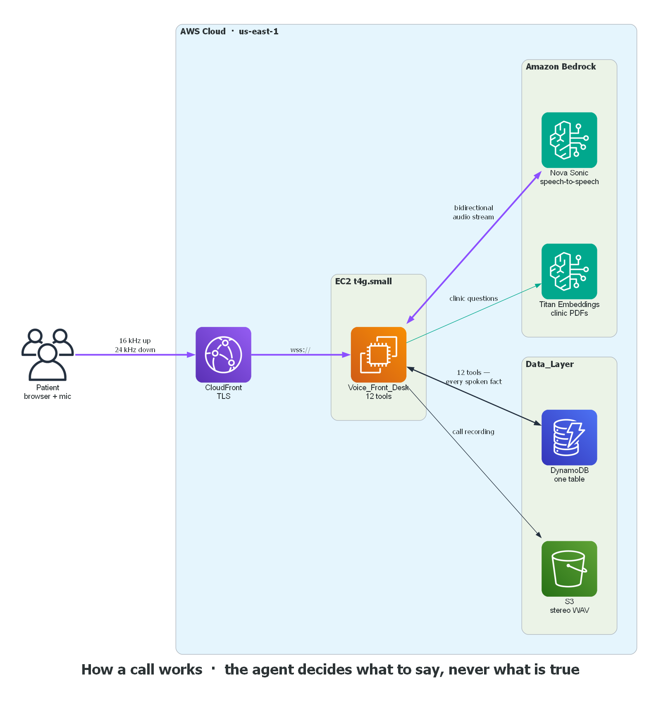
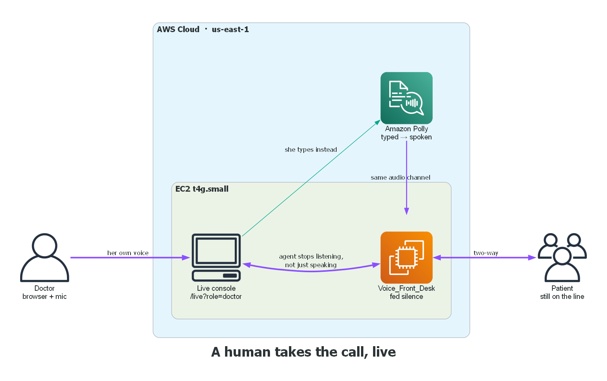
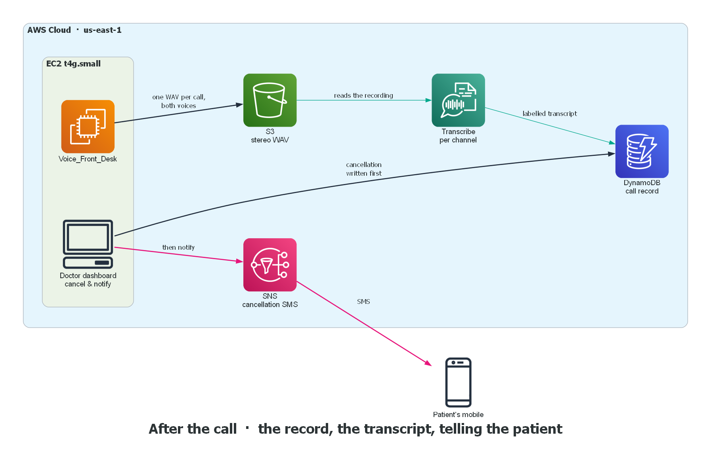

# Agents for Humans: A Voice Agent That Answers a Clinic's Phone and Never Invents an Answer

## The problem

Where exactly are you? What time do you open? Are you open Sunday? Do you do hearing tests?

A solo-doctor ENT clinic in Tirupati fields those four questions, in some order, all day long. The answers never change. They're painted on a board by the door and printed in a leaflet on the desk, and none of that helps, because the person asking is in an auto-rickshaw with a phone in her hand.

Answering them is necessary and completely unrewarding. It's also what makes the rest of the phone unmanageable. The doctor is mid-consultation when it rings, and the ring tells her nothing — this could be the fortieth "what are your timings" today, or a patient trying to move tomorrow's appointment. She can't know without stopping, so both get missed together.

**Clinic Front Desk** answers every call instantly, does the administrative work against a real calendar, and pulls the doctor onto the line in her own voice when a person is genuinely needed.

---

## Test it yourself, all three pages at once

The best way to understand this is to open the three pages side by side and watch a single call move across all of them. On the **caller page** you press Start call and simply talk — ask where the clinic is, what time it opens, whether it's open on Sunday, then book a slot, then change your mind and move it, then cancel it. The agent asks for your name and mobile, gives you back a five-character code, and collects your age, blood group, height and weight for the clinic's records. Everything you just said arrives on the **doctor's dashboard**: the appointment sitting in the day's schedule, the full slot calendar, your patient record with those details filled in, and the transcript and recording of the call you just made. The doctor has full access there — she can correct any field you got mis-transcribed, and cancel a booked appointment, which texts the patient. Then on the **live call page**, someone at the clinic watches calls as they happen, and the moment a caller asks for a person the page rings: one button puts a real human on the line in their own voice, while the agent steps back and stops listening. That whole conversation, both voices, is recorded and stored too. Start a call on the first page, keep the other two open, and you'll see the appointment appear and the handover ring in real time.

| 📞 Caller page | 🗓️ Doctor dashboard | 🎧 Live call page |
| --- | --- | --- |
| [Start a call](https://d21u7cmj563imv.cloudfront.net/voice) | [Open the dashboard](https://d21u7cmj563imv.cloudfront.net/?role=doctor) | [Watch live calls](https://d21u7cmj563imv.cloudfront.net/live?role=doctor&k=POsBgStYRRE64ZBytbrGdWvelnWXhrLd6jh6oLT3Af8) |
| Book, reschedule, cancel, ask anything | Schedule, patient records, transcripts, recordings | Take over a call in your own voice |

Needs a microphone and a Chromium-based browser.

> **`[IMAGE 1 — the agent call page]`**
> *Screenshot of `/voice` mid-conversation, with the live transcript visible.*
> Caption: The caller's page. Microphone in, the agent's voice back, transcript as it happens.

---

## What it does

- **Books, reschedules and cancels** against a real calendar, offering at most three concrete dated slots, because three is what a person can hold in their head on a phone.
- **Issues a five-character patient code** — first letter of the first name, last letter of the last name, last three digits of the mobile. *Sailaja Devi* on 9900012307 becomes **SI307**. Quoting it next call resolves the caller instantly.
- **Understands a number however it's spoken** — `9900012307`, "nine nine zero zero zero one two three zero seven", a `+91` prefix, or a half-converted mix all resolve to the same patient.
- **Answers clinic questions** — hours, address, directions, services, fees, the clinic's own phone number — from PDFs the doctor uploads. Updating what the agent knows is uploading a document, not editing code.
- **Routes a described problem to a service** using rules the doctor wrote herself. "Severe itching inside my nose" matches her `itching in nose` rule, and the agent speaks her own sentence back word for word.
- **Relays her urgent instructions instead of booking.** A rule can be marked urgent, and then the agent is forbidden from offering a slot at all — it says what she wrote instead. Quietly booking next Tuesday for sudden hearing loss is the most damaging thing this system could do.
- **Never composes clinical content of its own.** "My ear hurts, what's wrong with me?" gets a decline and an offer of a human. Anything the doctor hasn't written a rule for escalates rather than being guessed at.
- **Explains closed days** instead of failing: "The thirteenth falls on a Sunday, our clinic holiday. The nearest I have is Monday the fourteenth at nine."
- **Hands the call to the doctor live**, in her own voice, while the caller is still on the line.
- **Texts the patient** when the doctor cancels their appointment — demonstrated to one verified handset, since the account's SNS SMS tier is still the sandbox.

> **`[IMAGE 2 — the appointment page]`**
> *Screenshot of the doctor's dashboard day schedule, with booked appointments and the Cancel & notify button visible.*
> Caption: Every call lands here as a real appointment, with its transcript attached.

---

## The architecture

### One rule shapes everything

**The agent decides what to say. It never decides what is true.**

Every fact a caller hears comes from a tool that read the database. The model's job is to understand speech and choose a tool. It cannot invent an available slot, confirm a save that didn't happen, or answer a question about the clinic from its own training data.

That's why the interesting code in this project is the tool boundaries rather than the prompt. In clinic admin, a confident wrong answer is worse than no answer: a made-up opening time sends someone to a locked door, and a made-up price is a commitment the clinic has to honour.

### Four subsystems over one shared data layer

Before the pictures, the mental model. There are four moving parts, and **agents never touch storage directly** — everything goes through one data layer.

**Voice_Front_Desk** — reactive, patient-facing. A Strands Agents SDK `BidiAgent` voiced by Nova Sonic. A per-call `SessionContext` retains gathered facts across turns, so a caller never repeats a detail they already gave.

**Practice_Intelligence** — autonomous, doctor-facing, scheduled. Nobody talks to it.

**Dashboard** — a role-aware backend-for-frontend rendering server-side HTML plus live partials, with a server-sent-events change stream.

**Data_Layer** — abstract per-entity stores with two implementations, held to the same contract by the same tests.

In the repo those map to `voice/`, `intelligence/`, `dashboard/` and `data_layer/`, with `tools/`, `models/`, `scheduling/`, `documents/`, `handover/`, `notifications/`, `config/` and `deployment/` alongside.

The rest of this section is three pictures. One for an ordinary call, one for when a human steps in, one for what happens after everyone hangs up.

---

## Part 1 — how a call works



Follow it left to right. Purple is audio, teal is a call into a model, dark is a read or write of a fact.

**The browser** captures the microphone at **16 kHz mono PCM** and opens a WebSocket. Nothing is installed; a phone browser works. It needs a secure context for microphone permission, which is the first reason CloudFront is in the picture.

**Amazon CloudFront** terminates TLS and gives the demo a real certificate on a public HTTPS name, so `wss://` works from anyone's phone. It also carries the WebSocket upgrade through to the origin. Caching is disabled — every byte here is live audio — so CloudFront is doing TLS and reach, not caching. The EC2 security group only accepts port 80 from CloudFront's origin-facing prefix list, so the instance can't be hit directly.

**Amazon EC2 `t4g.small`** (ARM64, about 1.7 cents an hour) runs all of our code: the voice agent, the dashboard, the live console and the background agent. One small instance is enough because the heavy lifting is the model, not us.

**Voice_Front_Desk** is the agent itself — a Strands `BidiAgent` with 12 tools, the guardrail policy and barge-in handling. It decides *which tool to call*. It does not decide what any answer is.

**Amazon Bedrock — Nova Sonic** (`amazon.nova-2-sonic-v1:0`) is the conversation. The purple arrow is double-headed for a reason: this is one **bidirectional stream**, genuine speech-to-speech, with no transcribe-then-think-then-synthesise hop. That's why it sounds like a conversation rather than a voice assistant, and why interrupting it works — barge-in stops playback in under 500 ms, which there's a latency test for. The reply comes back as 24 kHz audio and plays immediately.

**Amazon Bedrock — Titan Text Embeddings v2** answers questions about the clinic from PDFs the doctor uploaded. Updating what the agent knows about services, directions or preparation instructions is uploading a document, not editing code or redeploying.

**Amazon DynamoDB** is the single source of truth: one table, 4 GSIs, holding appointments, slots, patients, waitlist entries, call sessions, escalations, decisions and config. Every fact the caller hears came out of here through a tool. That arrow is double-headed because the agent both reads the calendar and writes the booking.

**Amazon S3** takes one recording per call, written as a stereo WAV.

### The path of a single caller turn

1. The browser streams **16 kHz mono PCM** to **Nova Sonic** over Bedrock's bidirectional streaming API. The reply returns as 24 kHz audio.
2. The turn is classified into **structured signals** — asked for a human, named a symptom, requested clinical content, expressed distress — *before* the model gets to respond.
3. A **deterministic guardrail policy** runs on those booleans. Not on raw text, and not on the model's discretion.
4. The **tool orchestrator** runs the chosen tool. It enforces confirm-before-mutate, so no destructive action depends on the prompt behaving.
5. The tool reads or writes DynamoDB and returns a typed result. The caller hears only what came back.
6. On hang-up the call is finalised with an outcome: `booked`, `rescheduled`, `cancelled`, `waitlisted`, `escalated`, `no_action` or `interrupted`.

### The tool boundary is the security boundary

Twelve patient-facing tools: `match_offered_service`, `suggest_service_for_problem`, `check_availability`, `register_patient`, `lookup_patient`, `list_appointments`, `book_appointment`, `reschedule`, `cancel`, `add_to_waitlist`, `answer_faq`, `flag_for_human`.

Each is closed over its data-layer stores before the model ever sees it, so no store, table name or credential appears in a model-facing schema. The model can call `book_appointment`; it cannot reach the database.

Two capabilities are deliberately **absent** rather than merely forbidden. `fill_gap_from_waitlist` is doctor-approved only, and no patient-facing tool can **create** a slot — the agent may book and release, never publish. Without that, a caller pressing for an earlier time would eventually be offered a slot the doctor never opened. A guardrail can be talked around; a missing code path cannot.

### Clinical content is relayed, never generated

This is the design decision I'd defend hardest, and it's easy to state wrongly. The system **does** give callers clinical content. What it never does is author any.

A caller says "there's an itch inside my nose" and hears a clinical sentence in reply. That sentence is `SymptomRoute.advice` — the doctor's own wording, stored in the table beside everything else, and spoken **as-is**. A rule can also be marked `urgent`, which carries an `urgent_instruction`: the agent is then blocked from offering an appointment at all and relays her instruction instead.

The distinction is the whole design. A model inferring a service from a symptom is making a clinical judgement, unsupervised, on a recorded line, to someone who will act on it. A doctor writing `itching, sneezing, blocked nose -> ENT Consultation` is making that same judgement once, deliberately, in a place she can review and correct. The caller's experience is identical. Only the author changes.

So three things hold at once, and they're consistent:

- Callers get useful clinical guidance, because a person who doesn't know that what they need is called an "ENT Consultation" shouldn't be turned away for it.
- The model never writes that guidance. There is no code path from a symptom to a service except through a clinician-authored mapping, so the capability to guess doesn't exist.
- Anything she hasn't written a rule for **escalates to a human** rather than being improvised.

Matching is forgiving about grammar and strict about meaning: stopwords dropped, one level of suffix stemming, all phrase words required. "My nose is blocked" finds the *blocked nose* rule, while `nose` never collapses into `nosebleed`. The result reaches the guardrail as a **structured signal**, so the policy decides over testable booleans rather than prose.

### Two store implementations, one contract

The data layer is abstract per-entity interfaces with an in-memory implementation and a DynamoDB one, verified by the *same* test suite. That's what makes the whole agent testable offline with no AWS and no cost, and what stops the DynamoDB implementation drifting from the fake.

Storage is a **single DynamoDB table with 4 GSIs**. Writes emit `ChangeEvent`s, which the dashboard streams to the browser over SSE — no polling, no reload.

---

## Part 2 — a human takes the call, live

When a caller asks for a person, becomes distressed, or asks something clinical the doctor hasn't written a rule for, the agent stops and records the escalation with its reason and the transcript so far. The handover is then **delivered, not just filed**.



**The Live console** (`/live?role=doctor`) lists calls in progress, the ones needing someone first. It **rings** and shows a count in the tab title, so it doesn't have to be the thing being watched. One button puts the doctor on the call.

**The doctor's own microphone** goes straight down the existing WebSocket to the caller. Notice there's no AWS AI service on that path in the picture — no model, no synthesis. That's the point: the caller hears *her*, not an imitation of her.

**Voice_Front_Desk is fed silence.** This is the subtle part, and the one that was a real bug. The agent has to stop **listening**, not just stop speaking. My first version muted only its output, so the model kept forming replies to questions meant for the doctor and printed "interrupted — playback stopped" every time the caller spoke to her. Feeding the model silence in place of the caller's audio fixes it properly: it forms no replies at all.

**Amazon Polly** is the one AI service here, and only if she types. The **Say** box takes a typed line, Polly synthesises it in an Indian-English neural voice, and it's pushed down the same audio channel the caller's browser is already playing — so a human stepping in doesn't sound like a different clinic. Polly emits 16 kHz PCM against Nova Sonic's 24 kHz, which turned out fine: the client reads the sample rate off each frame and lets the browser resample.

Two things the diagram can't show, both about not leaving a caller in silence:

- **Nobody available?** At 12 seconds the caller hears that someone is still being fetched; at 45, an honest apology and a choice — leave a number, or ring back during opening hours. Spoken aloud, because a caller is holding a phone, not watching a screen. Both intervals are configurable.
- **If the doctor's tab dies**, the call goes back to the agent rather than to dead air.

> **`[IMAGE 3 — the live call page]`**
> *Screenshot of `/live?role=doctor` with a call needing someone, showing the Take over & talk button.*
> Caption: The doctor's live console. It rings, and one button puts her on the call.

---

## Part 3 — after the call



Two separate stories share this picture: making the call durable, and telling the patient when something changes.

**Amazon S3** holds one **stereo WAV per call** — caller on the left channel, clinic on the right, laid out on the real timeline so pauses are preserved and the two stay in sync. You can hear who interrupted whom, and a barge-in sounds like an interruption instead of garbled mono. On a medical line, the clinic's half of the conversation is the half that matters most, so the handover path explicitly records the doctor's audio too; without that, a call a human took over would have the caller's voice and silence where the clinic answered.

**Amazon Transcribe** reads that recording with **channel identification** and appends a labelled text transcript to the call record:

```
--- transcribed from the call recording (both sides, after the call) ---
[00:02] patient: My ear has been hurting since Monday
[00:06] clinic:  I can see you tomorrow morning at ten o'clock
```

Batch, not streaming, for a concrete reason: the streaming SDK pins `awscrt~=0.26.1` while Nova Sonic's bidirectional stream needs `0.36.2`. Downgrading the transport the entire voice agent depends on, just to add a transcript, is the wrong trade. Batch needs only `boto3`, which was already a dependency. It also runs **only for calls a human took over** — every other call already has a transcript from the agent's own turns, so transcribing them would pay Transcribe to re-derive one. The job is started after the call record is persisted and never awaited, so a slow transcription can't delay a hang-up.

The **audio is the record of authority** and the text is a searchable aid. Recognition isn't perfect — one verification run turned "I can see you tomorrow morning at ten o'clock" into "I can see it at 10 o'clock" — so the exact conversation is always the WAV.

**Amazon DynamoDB** receives the transcript, and it's also where the doctor's own actions land.

**Amazon SNS** is the last hop. When the doctor cancels a booked appointment from the dashboard, the patient gets a text. Without this the patient simply turns up — the dashboard knew the appointment was gone and the only person who needed to know didn't.

Three things about how that's wired, and the order in the diagram is deliberate:

- **The cancellation is written to DynamoDB before the SMS is attempted.** The database is the source of truth; the text is a notification about it.
- **A failed send is surfaced loudly**, never swallowed — the doctor is told the patient was *not* texted and to ring them herself. A silent failure here is worse than no feature, because she'd believe the patient knows.
- **An unparseable phone number is refused, never guessed.** Texting a misheard number tells a stranger about somebody's appointment.

**This is proved out at sample scale, not production scale.** The account's SNS SMS tier is the **sandbox**, which only delivers to numbers verified by one-time code, so I verified a single handset — my own — and sent real messages to it, with a $1 monthly spend cap as a backstop. The delivery path is genuine end to end: a real `Publish` call, a `Transactional` message, a real SMS on a real phone. What's limited is the destination list. Lifting that is an AWS support request to leave the sandbox, not a code change.

> **`[IMAGE 4 — the cancellation SMS]`**
> *Screenshot of the text message arriving on the patient's phone.*
> Caption: Sent through Amazon SNS the moment the doctor cancels.

---

## The second agent

There are two agents in this project. The first one talks to patients. The second one talks to nobody.

Practice_Intelligence wakes up on a schedule — at most every 24 hours — reads everything the first agent has written down, and leaves short suggestions for the doctor. Think of it as a clerk who goes through the appointment book once a day and puts notes on her desk. Each note is a **Decision** she can approve or dismiss.

Five things it looks for:

| It notices | The note it leaves |
| --- | --- |
| An open slot matches someone on the waitlist | *"Thursday 10am is free and Ramesh has been waiting for exactly that service. Book him?"* |
| Several people waitlisted for one service you do offer | *"Nine patients are waiting for a Hearing Test. You need more slots."* |
| Callers keep naming a service you don't offer | *"Five callers this month asked for allergy testing."* |
| A weekday is persistently empty at low utilisation | *"Wednesdays are running near-empty."* |
| The no-show rate moved against the previous period | *"No-shows are up on last month."* |

Only the first one **does** anything when approved: it books the earliest matching waitlisted patient and removes their entry. The other four are advice — they're operational changes the doctor makes outside the system, so approving one simply records that she agreed.

### Why this agent has no AI in it

This is the part worth stating plainly: **Practice_Intelligence uses no model at all.** The `intelligence/` package contains zero references to Bedrock or boto3. Every detector is ordinary Python arithmetic over the stored records — counting waitlist depth, comparing one period's no-show rate against the previous one.

That's a deliberate choice, not a shortcut. Counting how many people are on a waitlist doesn't need a language model, and plain arithmetic returns the same answer every single time. When the output is advice about how someone runs their practice, reproducible beats clever. It also means these tests need no credentials and cost nothing to run.

The scheduler is the same idea: it holds no threads and never sleeps. Time comes from an injectable clock and runs are driven by an explicit `tick()`, so a test can advance a fake clock and assert exactly when a run fires — which is how the "at most every 24 hours" guarantee is actually verified rather than hoped for.

This second agent is what makes the system more than an answering service. The calls become data, and the data becomes suggestions about how the practice runs.

---

## The AWS services, and what each is for

| Service | Role |
| --- | --- |
| **Amazon Bedrock** — Nova Sonic (`amazon.nova-2-sonic-v1:0`) | Real-time speech-to-speech over bidirectional streaming |
| **Amazon Bedrock** — Titan Text Embeddings v2 | Indexes the doctor's uploaded PDFs for clinic questions |
| **Amazon Bedrock** — Nova Lite (`amazon.nova-lite-v1:0`) | Reads clinic details out of an uploaded PDF to pre-fill the onboarding wizard |
| **Amazon DynamoDB** | Single table, 4 GSIs. Source of truth for every fact spoken aloud |
| **Amazon S3** | Uploaded clinic documents, plus one stereo WAV per call |
| **Amazon Polly** | Speaks the doctor's typed text down the caller's live channel |
| **Amazon Transcribe** | Post-call, channel-identified transcript of handover calls |
| **Amazon SNS** | Texts the patient when the doctor cancels (sandbox tier, one verified number) |
| **Amazon CloudFront + EC2** | Public HTTPS demo on a `t4g.small` ARM instance, ~1.7 cents/hour |
| **Bedrock AgentCore Runtime** | Containerised deployment target alongside the EC2 demo |
| **Amazon CloudWatch** | Logs and metrics |

Calls are answered **in the browser**. I also wrote and tested an **Amazon Connect** integration to put both ends on a real phone number, but it can't be enabled here: AISPL accounts — Amazon's Indian reseller — cannot create Connect instances, in any region. That's account-level, not a permission or a quota. The code activates on two environment variables the day it runs in an account with non-Indian billing.

---

## Where it stands

**1,787 tests passing. `mypy --strict` clean across 114 source files.** All offline, no credentials needed. Concurrency verified at 50 simultaneous callers against the live public URL with zero failures.

**Code:** https://github.com/DeepikaSidda/Clinic-Front-Desk
**Live demo:** https://d21u7cmj563imv.cloudfront.net/voice
